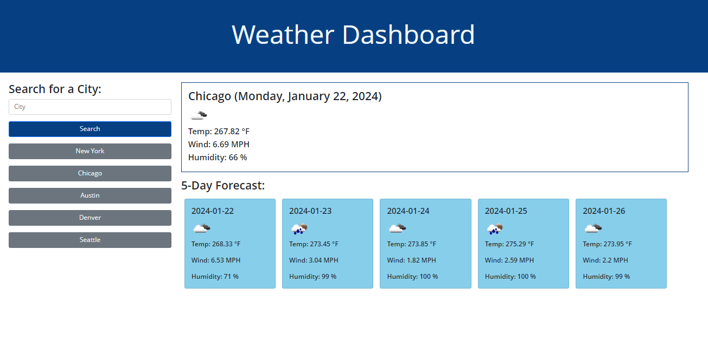

# Weather_Dashboard

## Description
A weather dashboard that will run in the browser and feature dynamically updated HTML and CSS. The application is using the 5 Day Weather Forecast API to retrieve weather data for cities, and localStorage to store any persistent data.

## Screenshot

## GitHub Repo
https://github.com/FannyCandy/06_Weather_Dashboard

## Deployed App
https://fannycandy.github.io/06_Weather_Dashboard/

## Credit / Resources used
NU BootCamp curriculum